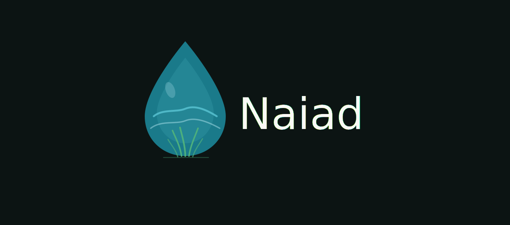

<div align="center">
  

  **Home Assistant add-on repository for Naiad — a garden irrigation controller, optimized for KNX.**
</div>

---

This repository packages [**Naiad**](https://github.com/Neffez/naiad) as a Home
Assistant add-on. It is the *same image* as the standalone Naiad container — only
the bootstrap and the Home Assistant connection differ ("one image, two modes").

## Add this repository

**Settings → Add-ons → Add-on Store → ⋮ → Repositories**, then add:

```
https://github.com/Neffez/app-naiad
```

[](https://my.home-assistant.io/redirect/supervisor_add_addon_repository/?repository_url=https%3A%2F%2Fgithub.com%2FNeffez%2Fapp-naiad)

Then install **Naiad** from the store and start it. Open it from the sidebar — no
login is required through Home Assistant ingress.

## What you get

- **Ingress sidebar entry** — opens Naiad inside Home Assistant, pre-authenticated.
- **No long-lived token needed** — the add-on reaches Home Assistant Core through
  the Supervisor proxy (`ws://supervisor/core/websocket`) with the auto-provided
  `SUPERVISOR_TOKEN`.
- **Optional direct port** (`http://<haos-ip>:5195` by default) for LAN clients that
  bypass Home Assistant. Toggle or remap it in the add-on's Network settings.
- **Persistent storage** on the add-on `/data` volume (SQLite + optional config
  seed), included in Home Assistant snapshots.

See [`naiad/DOCS.md`](naiad/DOCS.md) for full add-on documentation.

## Architecture

```
ghcr.io/neffez/naiad   (multi-arch app image, built by the naiad repo CI)
        │  FROM (multi-arch manifest → matching arch)
        ▼
  naiad/Dockerfile     (adds the Supervisor bootstrap: run.sh, /data, log_level)
        │
        ▼
  Home Assistant add-on  ──ingress──▶ sidebar
                         ──ports────▶ http://<haos-ip>:5195 (optional)
```

The add-on tracks the published Naiad image. Backend support for the add-on context
(Supervisor connection detection) lives in the [naiad](https://github.com/Neffez/naiad)
repository.

## Assets

`naiad/icon.png` and `naiad/logo.png` are generated from the brand tokens by
[`gen_assets.py`](gen_assets.py) (`python3 gen_assets.py`).

## License

MIT — see the [Naiad repository](https://github.com/Neffez/naiad).
